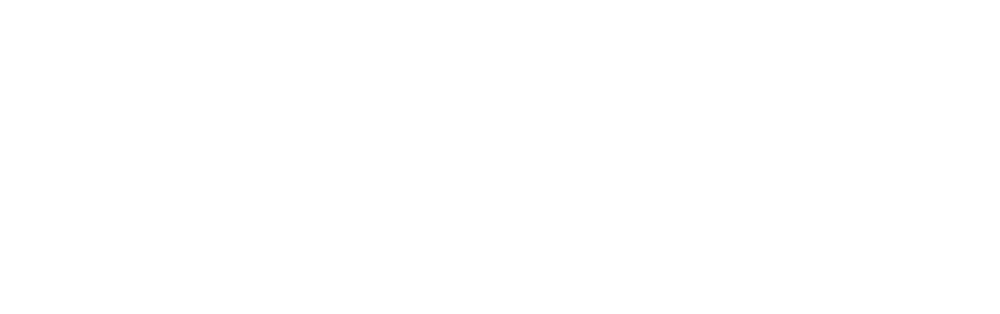

```js
import { LineGraph } from "./components/line-graph.js";
import { todayInFormat, getDateXDaysAgo } from "./utils/date-utils.js";
const CheckerParticipantsCumulative = FileAttachment("./data/checker-participants-cumulative.json").json();
const CheckerParticipantsMonthlyActive = FileAttachment("./data/checker-participants-monthly-active.json").json();
```

<div class="hero">
  <body><body>
    <h2>Dashboard</h2>
    <body><a href="https://dashboard.filstation.app" target="_blank" rel="noopener noreferrer">(Click here for Legacy Filecoin Station Grafana Dashboard)</a><body>
</div>

<h4>Checker Network Accounts</h4>

<div class="grid grid-cols-2" style="grid-auto-rows: 500px;">
  <div class="card">${
    resize((width) => LineGraph(CheckerParticipantsCumulative, {width, title: "Checker Network Account Created (unique FIL accounts)", xKey: "day", yKey:"participants" }))
  }</div>
  <div class="card">${
    resize((width) => LineGraph(CheckerParticipantsMonthlyActive, {width, title: "Monthly Active Checker Network Accounts (unique FIL addresses)", xKey: "month", yKey: "participants" }))
  }</div>
</div>

<div class="grid grid-cols-2" style="grid-auto-rows: 504px;">
</div>

<style>

.hero {
  display: flex;
  flex-direction: column;
  align-items: center;
  font-family: var(--sans-serif);
  margin: 4rem 0 8rem;
  text-wrap: balance;
  text-align: center;
}

.hero h1 {
  margin: 1rem 0;
  padding: 1rem 0;
  max-width: none;
  font-size: 14vw;
  font-weight: 900;
  line-height: 1;
  background: linear-gradient(30deg, var(--theme-foreground-focus), currentColor);
  -webkit-background-clip: text;
  -webkit-text-fill-color: transparent;
  background-clip: text;
}

.hero h2 {
  margin: 0;
  max-width: 34em;
  font-size: 20px;
  font-style: initial;
  font-weight: 500;
  line-height: 1.5;
  color: var(--theme-foreground-muted);
}

@media (min-width: 640px) {
  .hero h1 {
    font-size: 90px;
  }
}

</style>
